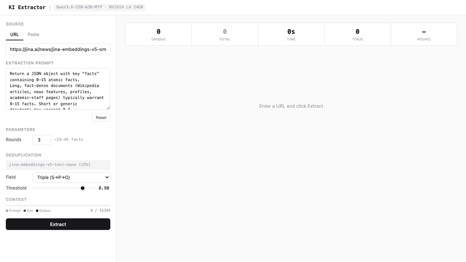

# KI Extractor

Extract structured Knowledge Indicators (KIs) from any document using a self-hosted LLM. Each KI is an atomic fact triple (subject, predicate, object) with evidence span, confidence score, and tags.



## What it does

1. Feed a URL or paste text
2. LLM extracts 0-15 structured facts per round, multiple rounds with different seeds for coverage
3. Real-time semantic dedup via [jina-embeddings-v5-text-nano](https://huggingface.co/jinaai/jina-embeddings-v5-text-nano) removes duplicate facts across rounds
4. Stream results as they arrive with live stats (tok/s, unique/total facts, context usage)

Inspired by the [Knowledge Indicators concept from Elastic](https://www.elastic.co/search-labs/blog/pre-computed-context-llm-agent-costs) for pre-computing agent context.

## Stack

| Component | What | Port |
|-----------|------|------|
| **llama-server** | [llama.cpp](https://github.com/ggml-org/llama.cpp) with CUDA, serves Qwen3.6-35B-A3B via OpenAI-compatible API | 8080 |
| **ki-extractor** | FastAPI app with extraction UI + jina-v5-nano dedup on CPU | 3000 |

## Hardware

Single NVIDIA L4 24GB GPU (e.g. GCP `g2-standard-8`). The model runs in **Q3_K_XL** quantization with MTP (Multi-Token Prediction) speculative decoding — benchmarked at ~76 tok/s decode, +34% over Q4_K_XL with no quality loss on this task (see [`autoresearch/`](autoresearch/REPORT.md)).

## Quick start

```bash
git clone https://github.com/hanxiao/ki-extractor.git
cd ki-extractor

# Set your Jina API key (free at https://jina.ai/api-key, used for URL-to-markdown)
cp .env.example .env
# edit .env and add your JINA_API_KEY

# On a fresh GCP L4 instance, run the one-shot setup:
bash scripts/setup.sh
```

This downloads the model (~17GB), pulls Docker images, and starts both services.

Once running, open `http://<your-ip>:3000`.

## Manual setup

If you already have Docker + NVIDIA Container Toolkit:

```bash
# Download model (~17GB). Uses the Python API; the hf/huggingface-cli console
# script is often not on PATH after a pip --user install.
mkdir -p models
pip install -q huggingface-hub
python3 -c "from huggingface_hub import hf_hub_download; \
hf_hub_download('unsloth/Qwen3.6-35B-A3B-MTP-GGUF', \
'Qwen3.6-35B-A3B-UD-Q3_K_XL.gguf', local_dir='models')"

# Start
docker compose up -d --build
```

## Configuration

### llama-server flags (in `docker-compose.yml`)

| Flag | Value | Why |
|------|-------|-----|
| `--ctx-size` | 16384 | Balance between input capacity and VRAM |
| `-fitt` | 512 | Auto-fit threshold, prevents OOM with MTP |
| `--spec-type draft-mtp` | — | MTP speculative decoding — load-bearing on L4 (+39% at Q3; removing it drops 76→54 tok/s) |
| `--spec-draft-n-max` | 3 | Draft 3 tokens per step (build default; best on L4) |
| `--spec-draft-p-min` | 0.1 | Draft only reasonably-confident positions |
| `--cache-reuse` | 256 | KV cache reuse across rounds (40x prefill speedup on same doc) |
| `--flash-attn` | 1 | Flash attention |
| `--no-mmap` | — | Required when auto-fit offloads tensors to CPU |
| `--n-predict` | 8192 | Max generation length |

### Extraction parameters (in UI)

| Parameter | Default | What |
|-----------|---------|------|
| Rounds | 3 | Extraction passes with different seeds |
| Dedup model | jina-v5-nano | Runs on CPU, 23 texts/sec |
| Dedup field | Triple (S+P+O) | Compare subject+predicate+object |
| Dedup threshold | 0.90 | Cosine similarity cutoff |

### Key findings from benchmarking

Full methodology, per-experiment logs, and 5-repeat confirmations are in
[`autoresearch/`](autoresearch/) (REPORT.md + strategies.md + progress.png).
Headline numbers (decode tok/s, fixed-seed, on the v5-omni article):

- **Q3_K_XL quant is the biggest lever: +34%** (56.5 → 75.9 tok/s) vs Q4_K_XL,
  with KI count, coverage, and groundedness all preserved. Decode is bandwidth-
  bound, so fewer bits/weight ≈ proportionally faster. ~3.5bpw k-quant is the
  quality floor — lower (i-quants, Q2) loses facts or fabricates evidence.
- **MTP n=3** (build default) + **`--spec-draft-p-min 0.1`** is the decode peak;
  n≥4 is slower. MTP is essential here (+39% at Q3) — the opposite of fast
  consumer GPUs where spec-decode is net-negative for this MoE; on the bandwidth-
  starved L4 its forward-pass amortization wins. MTP × quant are synergistic.
- **nothink mode** required: thinking wastes ctx on reasoning tokens.
- **JSON schema constraint**: ~0 decode overhead, guarantees valid output.
- **KV cache reuse**: 40x prefill speedup on same-document subsequent rounds.
- **Did NOT help** (measured): KV quant, smaller ctx, MXFP4 (inert); `--parallel`
  concurrent rounds, mixed-precision KV (harmful); n-gram drafting (loses to MTP).

## Cost

| Mode | $/hr | $/month |
|------|------|---------|
| GCP L4 standard | ~$0.86 | ~$620 |
| GCP L4 spot | ~$0.26 | ~$190 |

## File structure

```
├── app.py                  # FastAPI app (extraction logic + UI)
├── Dockerfile              # Container for ki-extractor
├── docker-compose.yml      # Both services
├── .env.example            # Environment variables template
├── templates/
│   └── chat_template.jinja # Qwen3.6 chat template (nothink mode)
├── scripts/
│   └── setup.sh            # One-shot GCP L4 setup
├── autoresearch/           # Throughput optimization dataroom (harness, experiments, REPORT.md)
├── models/                 # Model files (gitignored, ~17GB)
└── assets/
    └── demo.gif
```

## License

MIT
