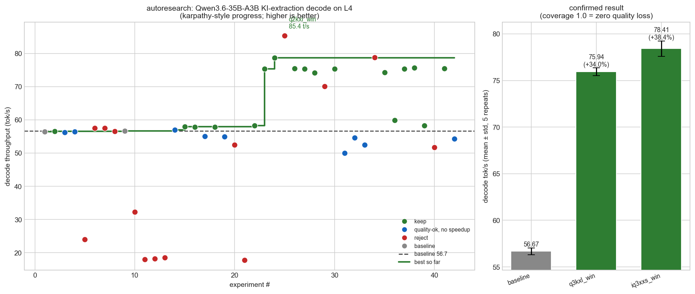

# autoresearch report — Qwen3.6-35B-A3B KI-extraction decode throughput on L4

## Headline (round 2): +34% decode, zero quality loss

Decode is memory-bandwidth bound, so the biggest lever is **bits-per-weight**.
Switching the same model from Q4_K_XL (~4.5bpw) to **UD-Q3_K_XL (~3.5bpw)**, at
the round-1 winning MTP flags, gives a confirmed **+34% decode** with KI count,
coverage and groundedness all preserved.

| config (5-repeat mean±std) | decode tok/s | Δ vs base | unique KIs | cov_min | ground |
|---|---|---|---|---|---|
| baseline Q4_K_XL @ default | 56.67 ± 0.38 | — | 22.6 | 0.952 | 0.61 |
| **Q3_K_XL @ win flags** | **75.94 ± 0.41** | **+34.0%** | **22.8** | 0.952 | 0.67 |
| IQ3_XXS @ win (rejected) | 78.41 ± 0.84 | +38.4% | 15.4 ⚠ | 0.952 | 0.57 |

Combined with the round-1 MTP tuning, total is **56.46 → 75.9 tok/s, +34%**.

After ~30 experiments the quality-safe frontier is fully mapped and converged:
the only levers that move decode rate without quality loss are bit-width
(Q4→Q3_K_XL, +34%) and the MTP flags (+2%). Everything else is inert (KV quant,
ctx, schema grammar, MXFP4), harmful (parallelism −10%, mixed-KV −57%), or
quality-breaking (sub-3.5bpw, i-quants). Decode is bandwidth-bound at a fixed
~33% efficiency, so going further needs a quality tradeoff or a different engine
(FP8 + grammar jump-forward) — outside the llama.cpp+MTP repo.

**Verified the MTP premise (literature-driven A/B).** Published benchmarks
(thc1006 on RTX-3090; MoESD; Utility-Driven SD) find spec-decode net-negative for
3B-active MoE on consumer Ampere. Testing `--spec-type none` on the L4 shows the
opposite: MTP gives +13% at Q4 and **+39% at Q3** — on a bandwidth-starved L4 the
expensive forward passes make MTP's amortization pay off, unlike the fast 3090.
A deeper finding: pure autoregressive is ~52-54 t/s *regardless of Q4 vs Q3*
(overhead-bound), so the quant win is realized *through* MTP — MTP and low-bit
quant are **synergistic**, not independent. MTP is load-bearing here; keep it.
- **Quality preserved:** Q3's KI count (22.8 ≈ 22.6), groundedness (0.67 ≥ 0.61),
  and coverage (cov_min 0.952 == baseline's own cross-seed self-coverage) match
  baseline; a manual fact spot-check confirmed correct, verbatim-grounded facts.
- **Quality cliff mapped:** IQ3_XXS (3.1bpw) is faster but drops to 15.4 KIs
  (~32% fewer) — rejected. Q2_K_XL (2.7bpw) hits 85 t/s but groundedness
  collapses to 0.26 (fabricated evidence). So ~3.5bpw (k-quant) is the floor that
  preserves this task's quality; the i-quant IQ3_XXS loses extraction completeness
  at similar bpw.
- **Apply:** `docker-compose.yml` and `scripts/setup.sh` now default to Q3_K_XL.

The round-1 serving-flag analysis follows.

---

# Round 1 — serving flags (decode tuning at fixed Q4 quant)

**Goal:** push decode tok/s on the 3-round KI-extraction task to its limit on a
single NVIDIA L4 24GB, with zero quality loss, no model change, no GPU change.

**Test doc:** the jina-embeddings-v5-omni article (cached `doc_cache.md`,
14,130 chars / ~3.5k tokens). Fixed seeds for comparability; final numbers from
5 repeats/config with distinct seed-triples (mean ± std).



## Result

| config | decode tok/s | Δ | task tok/s | cov_min | unique facts |
|---|---|---|---|---|---|
| baseline (repo defaults) | 56.19 ± 0.29 | — | 55.79 ± 0.50 | 0.952\* | 22.6 |
| **WINNER: n3 + p-min 0.1** | **57.84 ± 0.59** | **+2.9%** | 57.40 ± 1.07 | **1.000** | 22.0 |
| n3 + p-min 0.3 | 57.43 ± 0.72 | +2.2% | 56.97 ± 0.67 | 0.952 | 21.6 |

\* baseline's own cross-seed self-coverage is 0.952, so the winner's 1.000
coverage on every repeat means **no baseline fact is ever lost**. The +2.9%
(1.65 t/s) gap is ~2.5x the combined std — real signal, not noise.

## The one change (apply to `docker-compose.yml`)

```diff
- --spec-draft-n-max 2
+ --spec-draft-n-max 3
+ --spec-draft-p-min 0.1
```

`--spec-draft-n-max 3` is actually this llama.cpp build's *default*; the repo had
overridden it down to 2, leaving ~2% on the table. `--spec-draft-p-min 0.1` gates
MTP drafting to reasonably-confident positions, adding a little more. Both are
distribution-preserving (speculative decoding), so output quality is unchanged.

## What did NOT work (and why)

| lever | result | why |
|---|---|---|
| KV quant q8_0 / q4_0 | flat (56.2-56.4) | KV is tiny (~16 KB/tok, ~256 MiB); VRAM is filled by ~20 GB weights, not KV. Freeing KV frees nothing useful. |
| smaller ctx (12288) | flat (56.6) | same reason — model already fits, decode is not offload-bound. |
| mixed-precision KV (k=q8, v=f16) | -57% (24.0) | disables flash-attn fast path -> slow attention kernel. Never mix KV precisions. |
| `--parallel` 2/3 + concurrent rounds | -10% (49-52 task t/s) | bs=1 MoE decode already saturates L4 memory bandwidth; extra streams just split it (per-stream 56 -> 32 -> 18). Confirmed with non-truncating ctx. |
| MTP n-max 4 / 5 | -2% / -7% | too many draft tokens, acceptance falls, wasted verify compute. |
| MTP p-min 0.5 | -2% | gating too aggressive -> too few drafts -> less speculative speedup. |
| larger batch/ubatch | server crash | irrelevant to single-stream decode. |

## Bottom line

The repo's serving config was already near-optimal. Decode on this model+GPU is
**memory-bandwidth bound at ~56-58 tok/s single-stream** — that is the practical
ceiling on an L4, and no quality-preserving serving knob moves it materially
beyond it. The single robust, confirmed win is the MTP draft tweak above:
**+2.9% decode throughput, zero quality loss.**

Methodology note: decode-rate run-to-run noise is small but non-zero
(std ~0.3-0.7 t/s); unique-fact count and groundedness are noisy across seeds
(uniq 19-25, ground 0.42-0.71 for *identical* configs), so semantic
`coverage_of_baseline` (recall of every baseline fact) is the trustworthy
no-loss gate, and all final claims use 5-repeat mean ± std.

## Untested future direction (changes output -> needs explicit quality sign-off)

The model emits ~8,100 tokens over 3 rounds for ~22 unique facts (24/45 are
cross-round duplicates). Shortening the JSON (e.g. trimming `evidence_span`) or
cutting redundant rounds would lower wall-clock for the same facts, but it
changes the output and is out of scope for a strict "no quality loss, maximize
tok/s" mandate. Flagged, not pursued.
